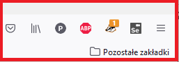
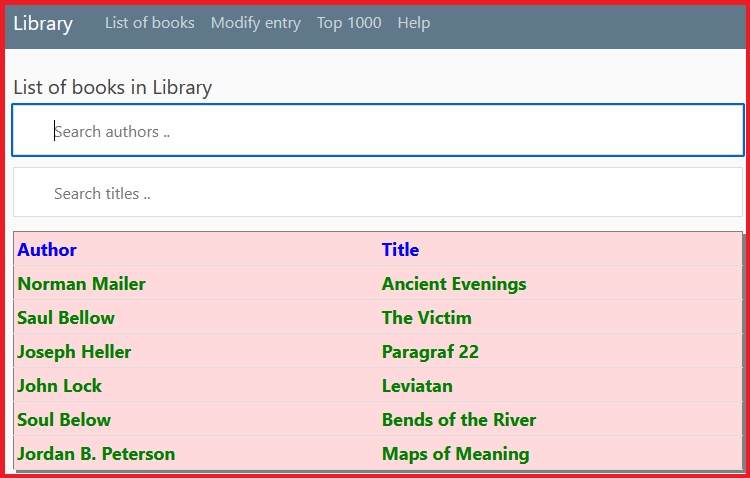
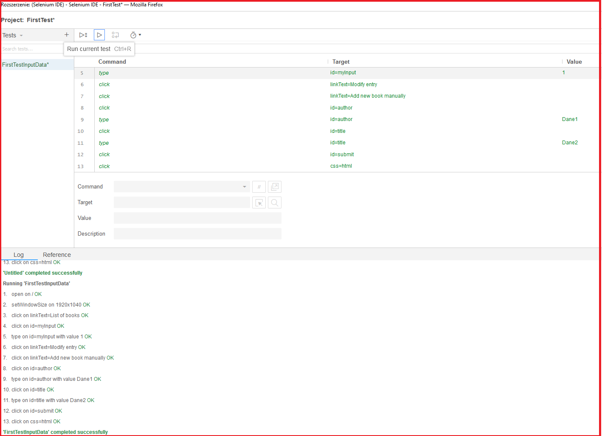
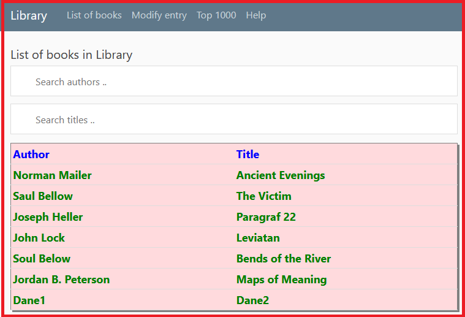
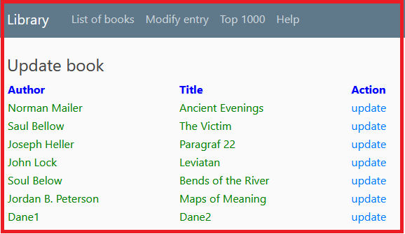
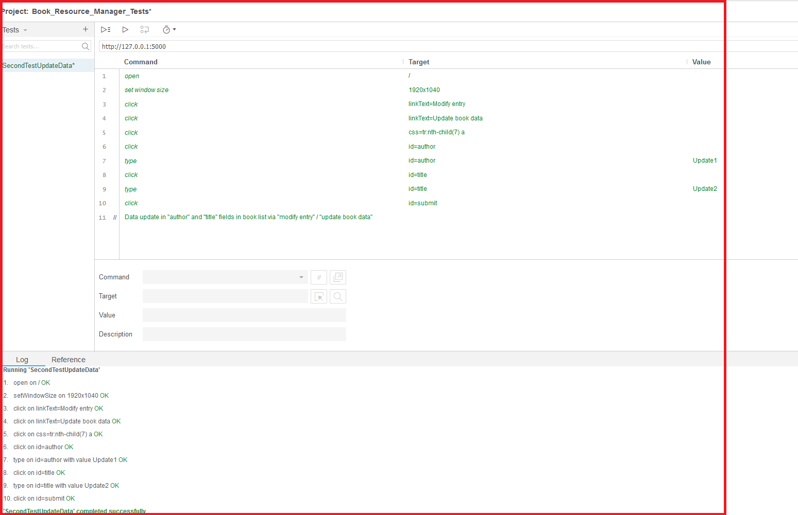
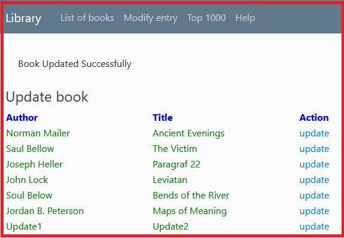
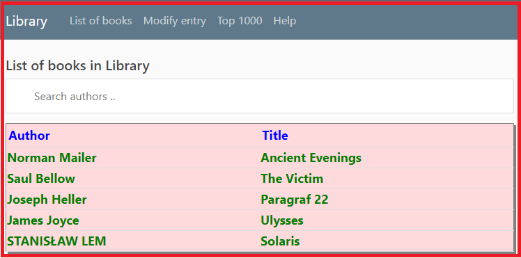
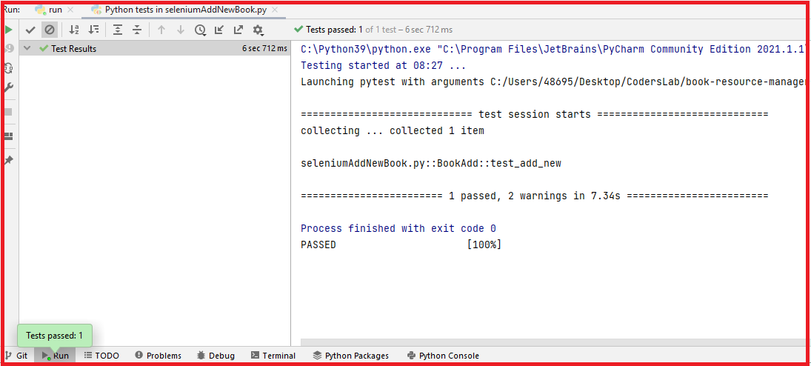
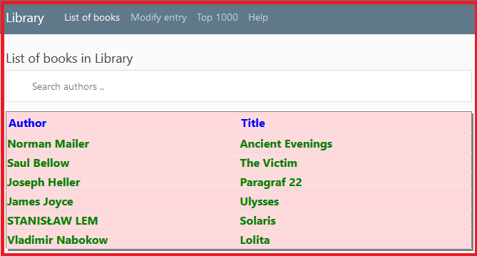

# Automated tests with Selenium browser extension tool

Selenium testing tool can be integrated with the browser.  
For the testing purpose Selenium IDE 3.17.10 is implemented in Mozilla Firefox 91.0.2 version browser in the test case
presented below.

## **First Test Input Data**

Selenium FirstTestInputData is recorded in order to input some data into the collection list. Namely, the transfer of
strings "Dane1" and "Dane2" into the dbase.db database as the book list items as "author"
and "title" arguments respectively.  

**Step 1.**

After sucessful implementation of Selenium extension tool into the browser
(Mozilla Forefox) the "Se" icon will appear at the tool menu

**Step 2.**
List of books in dbase.db before test: 

 

**Step 3.**
The data expected for transfer are introduced into the Selenium test set:

Statement of success status confirm the apropriate process run.
 

**Step 4.**

The check can be carried out to confirm the data were transfered correctly into the dbase.db:

 

 

## **Second Test Input Data**

Selenium SecondTestUpdateData is recorded in order to modify inserted recently data at the collection list. Namely,
strings "Dane1" and "Dane2" into the dbase.db database as the book list items instead of "author"
and "title" arguments respectively.  

**Step 1.**

List of books in dbase.db before test:

**Step 2.**
"Modify entry" and "Update book data" are clicked to get to the update mode:

**Step 3.**
Selenium recorder configured and recorded to modify data:

**Step 4.**

List of books in dbase.db after test:

 

## **Third Test Input Data**

Selenium **seleniumAddNewBook.py** is a test case file testing insertion of new book item into the list. 
Library collection will be enlarged by new item. It will be book by "Vladimir Nabokow" titled "Lolita". New data will be
inserted into table "books" in dbase.db sqlite3 database as "author" and "title" arguments respectively. 

**Step 1.**

List of books in **books** table  **dbase.db** before test:
 

**Step 2.**

Run **seleniumAddNewBook.py**  
The result of test executionis shown below:  

 

**Step 3.**
List of books in "books" table after test:

 

 

 

