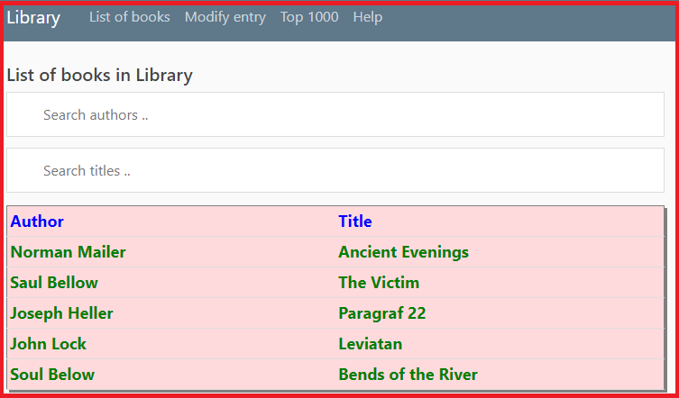
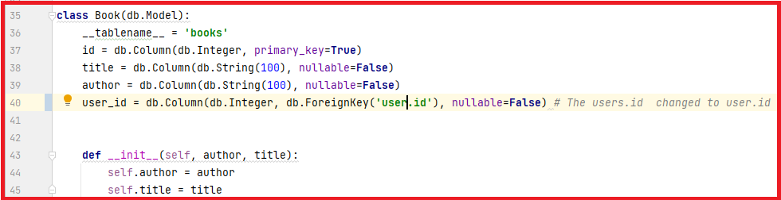
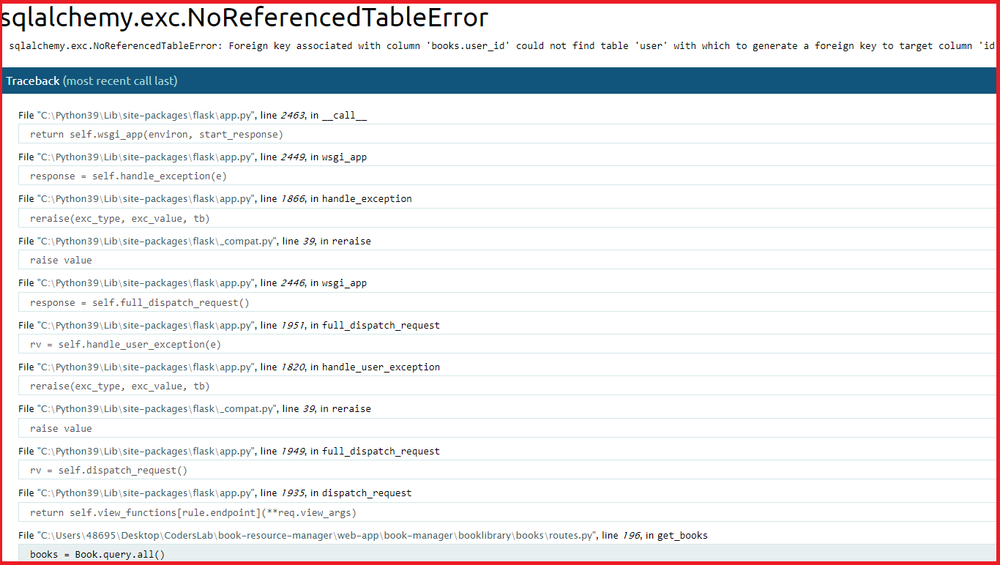
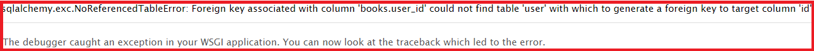
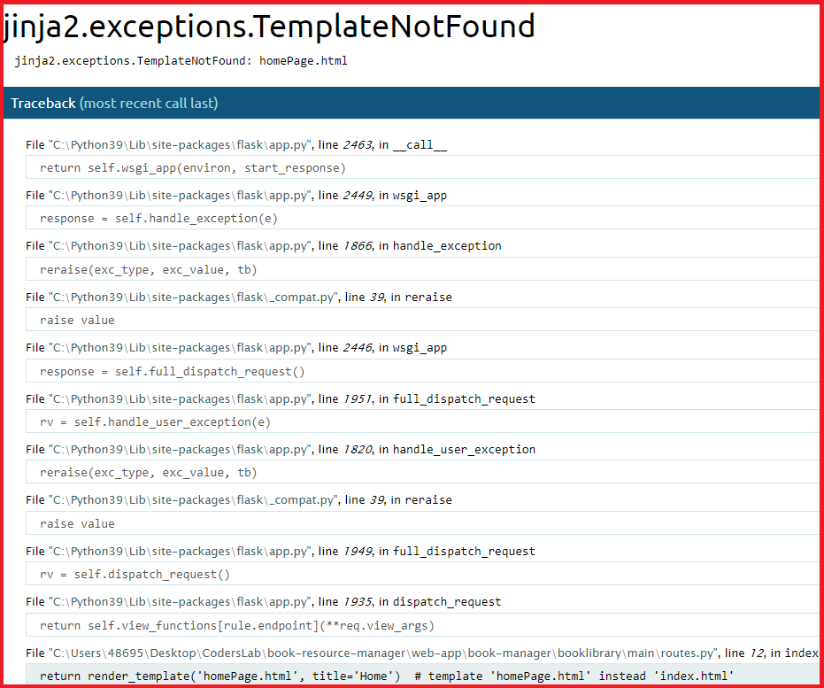
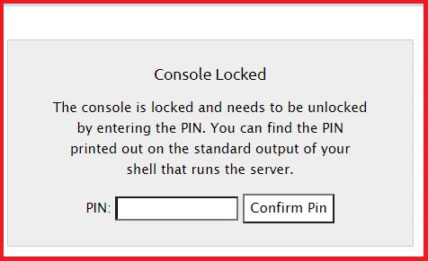
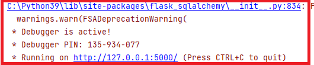
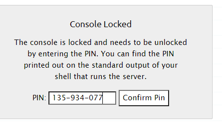
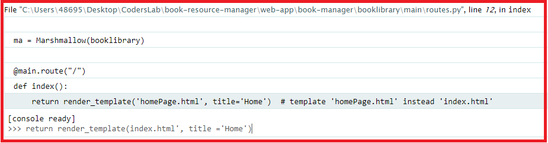

# IDE & Flask build-in testing tools

**W**hen the reloader is enabled, Flask watches all the source code files of your project and automatically restarts the
server when any of the files are modified. Having a server running with the reloader enabled is extremely useful during
development, because every time you modify and save a source file, the server automatically restarts and picks up the
change. 
**T**he debugger is a web-based tool that appears in your browser when your application raises an unhandled exception. The
web browser window transforms into an interactive stack trace that allows you to inspect source code and evaluate
expressions in any place in the call stack. By default, debug mode is disabled. To enable it use app.run(debug=True) in
the runner file. 

## **Manual Test 1**

**Epic:**
As a logged in user I want to see the list of books stored in the database.  
In order to see the book list as a User I click the "List of books" banner at the top menu. 
Action: User pressed the "List of books" banner.

 Below we can see the result of user Action where the relation of the API and database is correct:

In case of wrong mapping of foreign key as per code snippet presented:

Flask debugger whilest set to the True option will generate the "Traceback" screen:  

  

 With the description of the bug and the location of the and the Traceback to the code line in which the bug was originated.

## **Manual Test 2**

**Epic:** 

As a not loged in User I want to see the home page of the Library API

