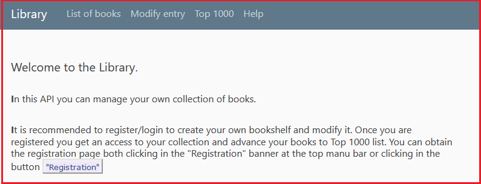

#Manual Tests 

## **Manual Test 1**

**Epic:** 
As an Registered User I want to login to the application with existing credentials.

Description

Main user: Manual Tester

What and where: Login

Acceptance criteria 

Important messages

1. When registrated user with credantials : {email: "M@S.pl", username: "Martin Scorsese", password: "Martin" } 
   open  API  with the most recent User logged out 
2. User can open the login forms from main menu clicking the baner "Login"/ "Modify"
3. User can open the login forms from clicking  the baner "Login"
4. User can fill the  "Email" field and "Password" field with testing credentials
5. User can tick the "Remember Me" box
6. User can cliks "Login" button

<u>Action 1 </u> 

Once User get a response from server the window with log in prompt site appeares:

 

<u>Action 2 </u> 

User inputs "M@S.pl" address to the field for email address  
User inputs "Martin" string to the field for password 

 

<u>Action 3 </u> 

User clicks in the "Login" button and the window of the home page of API "Library" appears:

 

 

## **Manual Test 2**

**Epic:**
As a loged in user I want to supplement the book collection with new item via inserting "author"
and "title" into the coresponding fields from selected image. 
New book should be represented in books table with following data:
{author: "Stanisław Lem", title: "Solaris"}  
The name of image is "solaris.jpeg" and is located in "/template" directory

What and where: Modify entry | Grab from image

Acceptance criteria:

Important messages: 

1. When user is logged in and 
2. User can open "Modify entry" banner from top menu
3. User can select an option: "Grab from image" 
4. User can "browse" selected image -"solaris.jpeg"
5. User can mark the string "Stanisław Lem", drag it from text box and drop it to author field
6. User can mark the string "Solaris", drag it from text box and drop it to title field  
7. by clicking "Save" button new book is inserted into the list 
8. User can open "List of books"  banner from top menu and check th enew item is at the list

<u>Action 1 </u>

Whilest loged into the API User cliks the "Modify entry" at the menu banner. 
The modify options appears

<u>Action 2 </u>

User can see the "List of books": 

 

<u>Action 3 </u> 

User cliks in "Modify entry" banner at top menu:

<u>Action 4 </u> 

User clicks "Grab from image" field. The dialog window appears:  

 

<u>Action 5 </u> 

User browses image "solaris.jpeg" and cliks "Open" button:
 
 

 
<u>Action 6 </u> 

User gets text from image by clicking "Get text" button:   
In the text box area the text appears:  

 

<u>Action 7 </u> 

User can mark and replace the appropriate string sections to the fileds "author" and "title" adequatly: 
User clicks "Save" button:  

 

<u>Action 8 </u> 
User can see the "List of books" after the modification: 

 

 

 

## **Manual Test 3**

**Epic:** Simple way for manual check of database modification correctness based on script **sqlTest2.py**.
  

 
<u>Action 1</u>
 

Run **sqlTest2.py** to check the records in "users" and "books" tables in **dbase.db** 

Save the output from terminal

 <u>Action 2</u>
 

List the actual book's list at the table via the API "List of books" option clicked at the top menu: 
 

<u>Action 3</u>
 

Given User is logged in to the API. 
User can open menu "Modify entry" by clicking top menu banner: 

and User can get to the "Add new book" option:  

<u>Action 4</u>
 

User can input new item to book list table via the API interface. 
Parameters for test : {author: "James Joyce", title: "Ulysses"}
 

 

Once the form is filled user can click "Save" button  

<u>Action 5</u>
 

Run **sqlTest2.py** again to check the new item is present in **book** table in **dbase.db**
 

<u>Action 6</u>
 

Run the "Library" as loged in user and open "List of books" from menu bar 
 

<u>Action 7</u>
 
Compare the list of books at the API and the list from table **books** in **dbase.db**.  
As both lists consists of the same items:  

 

 
